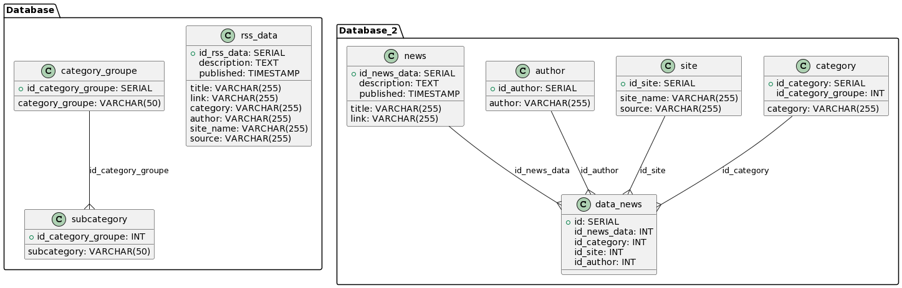

# "Анализ публикуемых новостей" с использованием Airflow

## Общая задача

Проект "Анализ публикуемых новостей" направлен на создание процесса ETL (Extract, Transform, Load) для формирования витрин данных, необходимых для анализа публикаций новостей. Основной целью является сбор, обработка и представление информации о новостях из различных источников в удобном для анализа формате.

## Подробное описание задачи

### Скрипты загрузки данных

- Разработаны скрипты загрузки данных в двух режимах:
  - Инициализирующий — загрузка полного слепка данных источника.
  - Инкрементальный — загрузка дельты данных за прошедшие сутки.

### Структура хранения данных

- Организована структура хранения данных, включающая:
  - Сырой слой данных.
  - Промежуточный слой.
  - Слой витрин.

### Результаты работы программного продукта

- Написан скрипт, формирующий витрину данных, включающую следующую информацию:
  - Суррогатный ключ категории.
  - Название категории.
  - Общее количество новостей из всех источников по данной категории за все время.
  - Количество новостей данной категории для каждого из источников за все время.
  - Общее количество новостей из всех источников по данной категории за последние сутки.
  - Количество новостей данной категории для каждого из источников за последние сутки.
  - Среднее количество публикаций по данной категории в сутки.
  - День, в который было сделано максимальное количество публикаций по данной новости.
  - Количество публикаций новостей данной категории по дням недели.

### Дополнение

- Производится приведение разнообразных названий и категорий к единому виду для обеспечения единообразия данных.

### Источники

- Используются следующие источники новостей:
  - [Lenta.ru](https://lenta.ru/rss/)
  - [Vedomosti](https://www.vedomosti.ru/rss/news)
  - [TASS](https://tass.ru/rss/v2.xml)

### Схема базы



### ETL-процесс

1. **Извлечение данных (Extract):**
   - Данные из различных RSS-каналов, таких как [Vedomosti](https://www.vedomosti.ru/rss/news), [Lenta.ru](https://lenta.ru/rss/), [TASS](https://tass.ru/rss/v2.xml), извлекаются с использованием библиотеки feedparser.
   - Загруженные данные сохраняются в сырой слой базы данных PostgreSQL.

2. **Трансформация данных (Transform):**
   - Данные подвергаются процессу трансформации, включающему приведение к единому формату категорий, обработку HTML-кода для получения текста новостей, а также создание связанных таблиц для нормализации базы данных.
   - Используется библиотека BeautifulSoup для парсинга HTML-кода новостей.

3. **Загрузка данных (Load):**
   - Преобразованные данные загружаются в промежуточный слой базы данных PostgreSQL.

4. **Формирование витрины данных:**
   - Создается витрина данных, предоставляющая информацию о категориях, количестве новостей, среднем количестве публикаций в сутки, и др.
   - Витрина формируется с использованием SQL-запросов, агрегирующих данные по категориям, сайтам и дням публикаций.

5. **Оркестрация через Apache Airflow:**
   - Airflow используется для автоматизации выполнения ETL-процесса.
   - Задачи в DAG (Directed Acyclic Graph) определены для каждого этапа процесса, включая извлечение, трансформацию и загрузку данных.
   - Используется DAG (Directed Acyclic Graph) в Apache Airflow для выполнения SQL-запроса, формирующего представление для анализа данных. Оператор PostgresOperator в Airflow используется для выполнения SQL-запроса

### Инструменты и технологии

- Используется язык программирования Python для написания скриптов ETL.
- Airflow используется для оркестрации и автоматизации процесса.
- PostgreSQL является основной базой данных для хранения сырых и обработанных данных.

### Замечания

- Для сайта ТАСС и Ведомости, где не предоставляется текст новости в RSS-ленте, используется веб-скрапинг с использованием библиотеки BeautifulSoup для получения текста новости.
- Проект предусматривает обработку дубликатов по ссылкам на новость, а также унификацию категорий для обеспечения единообразия данных.

## Описание DAG

1. **get_category_groupe:**
   - Задача для извлечения и загрузки категорий и подкатегорий в базу данных.

2. **get_site_name:**
   - Задача для извлечения и загрузки уникальных имен сайтов и их источников в базу данных.

3. **get_authors:**
   - Задача для извлечения и загрузки уникальных авторов новостей в базу данных.

4. **get_category:**
   - Задача для извлечения и загрузки уникальных категорий новостей в базу данных.

5. **extract_and_fill_news:**
   - Задача для извлечения и загрузки новостей в базу данных.

6. **fill_data_news:**
   - Задача для извлечения и загрузки связанных данных (категорий, сайтов, авторов) для новостей в базу данных.

7. **execute_sql_rss_news_analisis** и **execute_sql_day_of_week**:
   - Задача, использующая PostgresOperator, для выполнения SQL-запроса в DAG.

## Замечания к SQL-запросу

- В SQL-запросе проводится анализ данных, включая подсчет общего количества новостей, количества новостей за последний день, среднего количества публикаций в день и других метрик.
- Используется оконная функция RANK() для определения дня с максимальным количеством публикаций для каждой категории.
- SQL-запрос выдаст информацию о категориях, сайтах, днях максимального количества публикаций, общем количестве новостей и других параметрах для анализа.
- SQL-запрос создает в базе данных PostgreSQL два **VIEW** представления (таблицы): **rss_news_analisis** и **day_of_week**.

## Есть несколько способов визуализации данных из представления в PostgreSQL. Вот некоторые из них:

1. Использование инструментов для создания графиков: Вы можете использовать инструменты для создания графиков, такие как Matplotlib (для Python), чтобы визуализировать данные из представления. Можно SQL-запрос к представлению, получите результат и передайте его в инструмент для построения графиков.

2. Подключение к представлению в BI-инструменте:(Business Intelligence), такие как Tableau, Power BI или Superset, можем подключиться к представлению в этом инструменте и визуализировать данные с помощью его возможностей.

3. Создание интерактивного веб-интерфейса: Используя веб-фреймворки, такие как Flask (Python) или Django (Python), можно создать интерактивный веб-интерфейс, который будет получать данные из представления и визуализировать их с помощью графиков или таблиц.

4. Самый простой выполнить запрос с помощью psql

Выбор способа зависит от ваших предпочтений, навыков и требований к визуализации данных.

Команда вывода представлений с помощью psql:

- Для подключения к контейнеру с базой выполните следующий код:

```bash
docker exec -it  postgres_app psql -U postgres -d rssnews
```

- Для вывода представления с данными:

***для представления rss_news_analisis***

```sql
select * from rss_news_analisis;
```

***для представления day_of_week***

```sql
select * from day_of_week;
```

Проект обеспечивает удобный механизм для анализа и мониторинга публикаций новостей из различных источников, а также позволяет выявлять тенденции и популярные темы в определенные дни.

## Установка и настройка Apache Airflow

Введите в консоле команду

```bash
docker compose up airflow-init
```

после того как пройдет инициализация введите в консоль команду для старта контейров

```bash
docker compose up -d
```

Доступ в веб интерфей AirFloy осуществляется по адресу **127.0.0.1:8080** **Login: airflow Password: airfloy**

Оркестратор настроен:

- Каждые 10 минут получать сырую информацию из новостных каналов и записывать в базу PostgreSQL.
- Один раз в день формировать промежуточный слой и формировать витрины.

В Apache Airflow для настройки подключения к базе данных PostgreSQL нужно создать соответствующую запись в файле конфигурации Airflow или настроить соединение через пользовательский интерфейс Airflow.

***В проекте настроено импортирование подключения во время развертывания Docker контейнера.***

**Настройка через пользовательский интерфейс Airflow:**

- Зайдите в веб-интерфейс Airflow (обычно доступен по адресу http://localhost:8080).

- Перейдите во вкладку "Admin" и выберите "Connections".

- Нажмите кнопку "Create" или "Add a new record".

- Заполните поля:

- **Conn Id:** Уникальный идентификатор для подключения, как в dag, *"sql_query"* или свой *"my_postgres_connection"*, не забыть поменять в dag.

- **Conn Type:** Выберите "Postgres".

- **Host:** "db" Адрес сервера базы данных. Прописан в docker-compose.yaml

- **Schema:** "rssnews" Имя схемы. Прописан в docker-compose.yaml

- **Login:** "postgres" Имя пользователя для доступа к базе данных. Прописан в docker-compose.yaml

- **Password:** "postgres" Пароль пользователя. Прописан в docker-compose.yaml

- **Port:** "5432" Порт сервера базы данных (по умолчанию 5432 для PostgreSQL). Прописан в docker-compose.yaml

- Нажмите кнопку "Save" для сохранения настроек подключения.